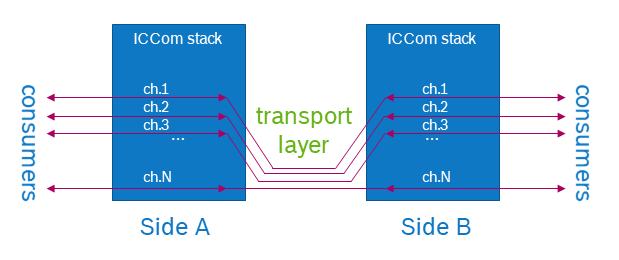
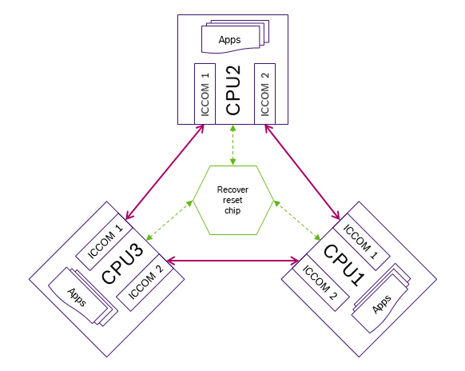
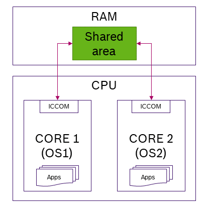
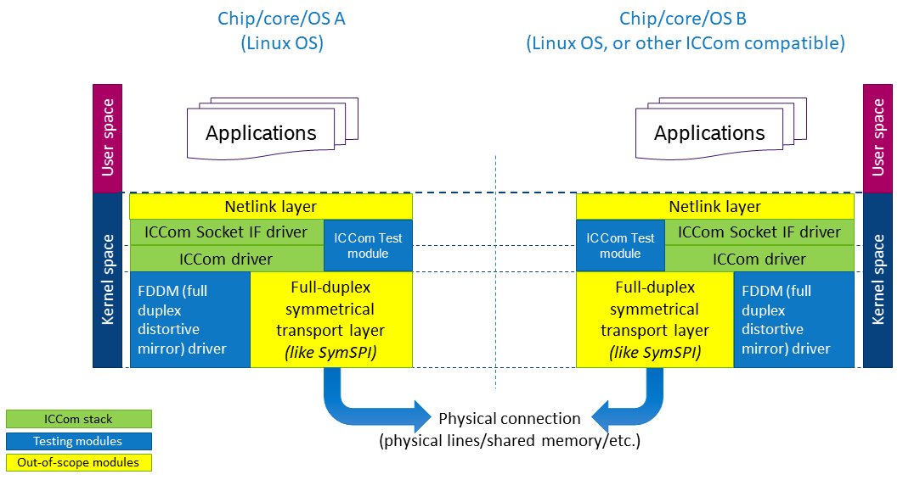
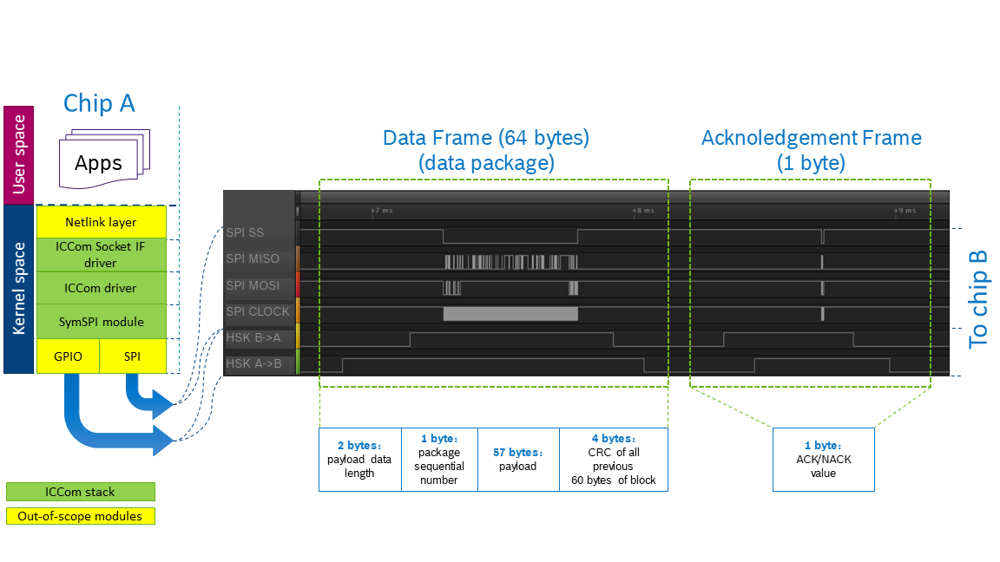
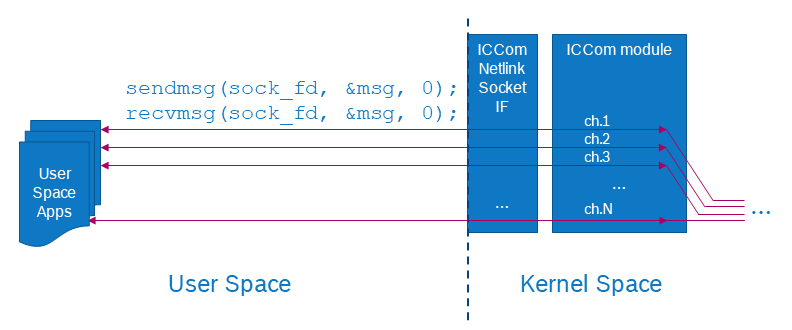
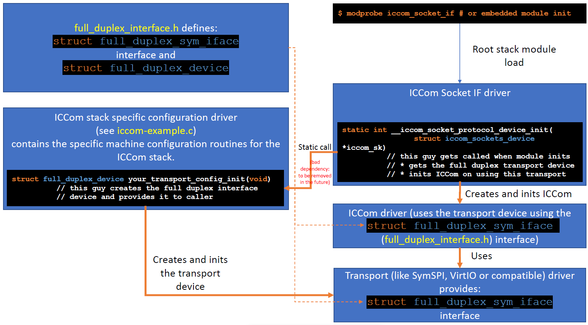
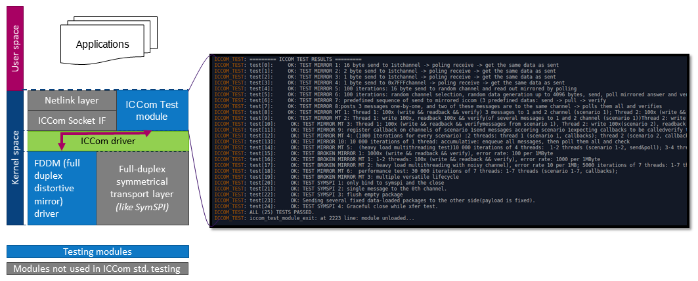
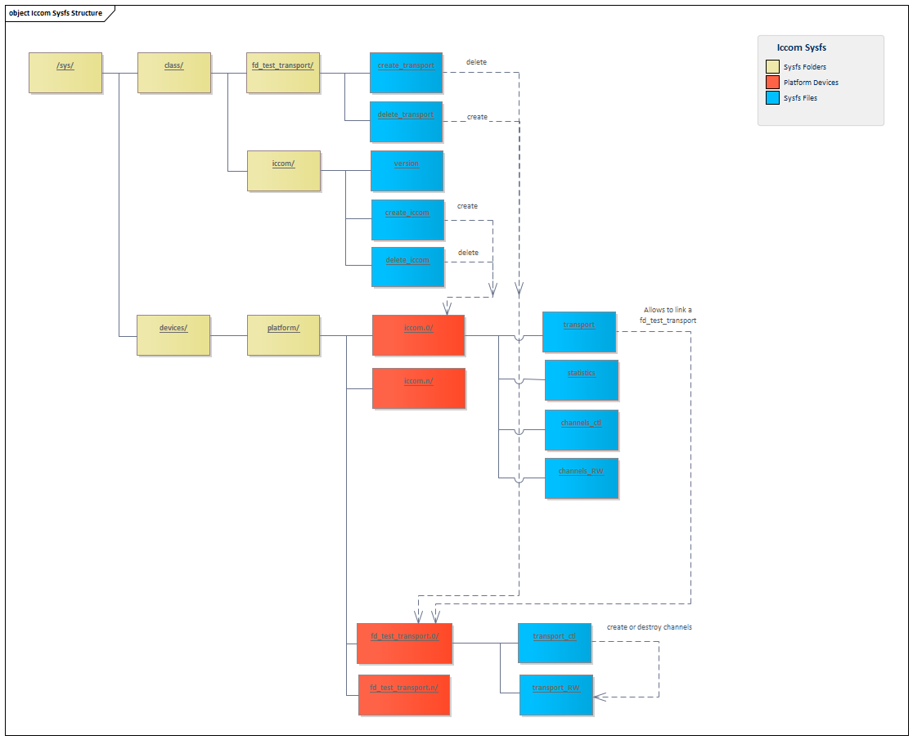

# What is it?

ICCom (Inter Chip Communication) is a Linux communication
driver, which provides a guaranteed delivery message-based
multi- logical channel communication for Kernel (and User)
space consumers and is based on a symmetrical full-duplex
data transport layer (like one provided by SymSPI driver, see
[SymSPI](https://github.com/Bosch-SW/linux-symspi), or
a compatible shared memory driver, etc.). Transport layer can
connect two independent chips or independent cores which
run different/same OSes.

Key points for ICCom are:
* point-to-point (from application point of view) communication
  driver,
* message based,
* with multiple bi-directional logical channels,
* with guaranteed delivery,
* based on full-duplex symmetrical data transport layer,
* provides its functionality to Kernel and User (if
  ICCom socket interface driver is also used) spaces,
* can be used to connect two independent chips
  or two (or with minor modifications more) independently
  run cores of the single chip.

Here how it does look from application perspective:



**NOTE:** at current moment only single transport layer instance
  is supported per *single* ICCom instance, meaning that one can not,
  say, interconnect a chip to many other chips using a single
  instance of ICCom, cause for now ICCom is only about pairwise
  connectivity (connects two chips, or two independent cores,...).

**NOTE:** at the same time one can use many ICCom instances
  each with its own transport layer to connect one chip
  to many. Only minor changes in the ICCom Socket IF driver
  will be needed.

# What is it for?

If one has a need to have two (or more, if more than one
ICCom instances used) independent systems on a device
(say a supervisor/safety-critical system, and a supervised/secondary
system, or two independent systems of equal rank which monitor
and sync with each other), then one will have to establish some
system which allows a peer-to-peer communication of User space
applications between sides.

ICCom stack offers just this: to communicate to an application B on
the other side application A needs to open a netlink socket (in
case of Linux OS implementation) number X (as well as Application B),
and then just send/receive messages to/from counterpart application
like in ordinary socket communication.

**NOTE:** the communication sides can be independent chips (then
  SymSPI can be used as corresponding transport layer), or independent
  cores of a single chip (then shared memory driver can be used for
  transport).

In two very short examples:
* take two CPUs, connect them with 4 SPI lines and 2 GPIO lines,
  configure GPIOs, take Linux OS + SymSPI diver + ICCom stack and
  done: your applications on both CPUs can talk to each other,
* take one CPU, isolate cores to run independent OSes, configure
  shared memory region, write small shared memory communication
  wrapper (trivial one) which will map shared memory RW operations
  to full-duplex symmetrical interface, put ICCom stack on top, and
  again, you have your applications talking with each other with
  mininal effort.

**NOTE:** as long as ICCom is relatively small and simple and abstracted
  from underlying transport, it can be ported with relatively minor effort
  on other OSes (like realtime OSes, OSes without dynamic memory
  allocation, etc.).

# What problem it solves

Let's work out couple of use-case scenarious =)

## Scenario 1 (a bit epic):

Say you have a device which needs to be robust and must have a
functional redundancy to provide it, so you choose to have a tripple
CPU system, where each CPU runs the same task independently and
possibly on different OSes. Then you need to connect every relevant
application A on each CPU to instances of application A on other
CPUs to allow them compare, say, intermediate computaional results.
And then compare the computational results on each CPU, and then
if matched just continue nicely, and if not match trigger diverging
CPU reset via separate and simple voting schematics (when at least
two votes are needed to reset a CPU).

ICCom allows you to do this almost out of the box for Linux OS
(only minor changes will be needed in ICCom Socket IF to separate
the range of sockets toward CPU X and toward CPU Y).

The system will look like this:



For transport layer one can use SymSPI
[SymSPI](https://github.com/Bosch-SW/linux-symspi) which is seamlessly
ICCom compatible on Linux OS.

In case of other OSes, main part of ICCom code is still usable and
only memory management routines are to be adjusted.

## Scenario 2 (a bit less epic):

You need to make a device with two separated domains: one is safety/security
critical and the other provides an extended user-friendly functionality,
meanwhile these domains need to communicate somehow. Say, you think that a
single CPU with independently running cores would be enough to fit your
aim.

ICCom again, allows applications from both domains natively communicate with
each-other using netlink sockets: the only thing which is to be implemented
is a shared memory driver which implements symmetrical full-duplex transport
protocol. And you're done: both cores work under Linux OS (say, of different
modifications) and applications in both domains can communicate via standard
netlink sockets, see picture below.



# How does it look like

## In Kernel context

The big picture of ICCom location in the system looks like following:



ICCom runs on top of a transport layer and provides a messaging
interface to the Kernel space and also via ICCom Socket IF
layer and netlink layer to the User space.

**NOTE:** ICCom driver itself has no dependency on the used socket
  type, neither on any other User space interface. ICCom itself
  just only provides its protocol API to the kernel. And this API can
  then be exported via ICCom Sockets IF driver to the User space.
  Thus if one would want to use some other interface to the User
  space or even leave ICCom only for inter-kernel communication
  without any User space application involved - it can be done without
  touching a line in the ICCom itself.

Transport layer below ICCom has only one requirement: to be
symmetrical (can be initiated from either communication side)
and full-duplex (bi-directional data transmission):

```c
struct full_duplex_sym_iface {
        int (*data_xchange)(void __kernel *device
                            , struct __kernel full_duplex_xfer *xfer
                            , bool force_size_change);
        int (*default_data_update)(void __kernel *device
                                   , struct full_duplex_xfer *xfer
                                   , bool force_size_change);
        bool (*is_running)(void __kernel *device);
        int (*init)(void __kernel *device
                    , struct full_duplex_xfer *default_xfer);
        int (*reset)(void __kernel *device
                     , struct full_duplex_xfer *default_xfer);
        int (*close)(void __kernel *device);
};
```
For more information on the full duplex symmetrical interface see
its repo:
[Full-Duplex Symmetrical Interface](https://github.com/Bosch-SW/linux-full-duplex-interface)

**NOTE:** to support several physical buses mapping to channel
  set, one will only need to update the ICCom Socket IF driver,
  which will redirect messages from a given range of channels
  to specific instance of ICCom attached to specific physical
  connection.

## In Hardware

There are no transport hardware requirements for the ICCom.
The transport hardware is totally abstracted by the transport
layer, see:
[Full-Duplex Symmetrical Interface](https://github.com/Bosch-SW/linux-full-duplex-interface).

RAM requirements are configurable: ICCom keeps all messages
which were not yet consumed by the consumer layers (internal
kernel consumers, which also can proxy User space applications),
as well as all outgoing packages which were created but not yet
sent. So if transport bandwidth doesn't allow one always to fit
the data flow, then ICCom can allocate quite enought of memory
to store pending incoming messages/outgoing packages.

**NOTE:** ICCom is not hardware accelerated, so at higher bandwidth
it will consume more CPU resources.

## From Protocol perspective

The ICCom flow consists of communication frames. A single communication
frame consists of two transfers:
* Data package bi-directional transfer,
* Ack package bi-directional transfer.

So in each communication frame sides exchange first with data packages
and then with ack packages, here the example with SymSPI + ICCom
on-wire view:



Data package consists of a header which contains following fields (see
also picture above):
* Payload data length (2 bytes)
* package sequential number (1 byte)
* payload section (57 bytes)
* CRC32 of all previous 60 bytes (4 bytes)

Ack package is of one byte size and can contain only
one of two values:
* NACK
* ACK

Ack package either acknowledges the successful receiving and parsing
of the Data package or not.

Data package payload contains 0 or more sequentially placed packets,
each of them contains:
* header, consisting of:
  * packet payload length (2 bytes)
  * destination channel number (15 bits)
  * message finalized flag (1 bit)
* message payload (variable length)


For the rest of details refer to source code documentation.

## In internals

No surprize: ICCom manages two flows of data:
* incoming data
* outgoing data.

Incoming data consists of the packages, these packages are
parsed, checked as well as all included packets which data is
then dispatched into internal incoming messages storage where
current messages are assembled and assembled messages are waiting
to be delivered to consumers. When message is delivered it is
discarded from the storage.

Outgoing data consists of the messages ordered to be sent. These
messages are split down to chunks of appropriate size, then these
chunks are packed into the packets and the packets are packed into
currently assembled package (new packages will be allocated as needed).

Transport layer provides the `data_xchange` routine and `data_ready`
callback, which are used to send and receive the packages to/from
the transport layer.

Surely it also handles "not-acknowledged" as well as
"transport-failed" situation.

## Provided API

The ICCom driver API (exposed to the
Kernel space) is listed below:

```c
int iccom_post_message(struct iccom_dev *iccom
                , const char *data, const size_t length
                , unsigned int channel
                , unsigned int priority);
int iccom_flush(struct iccom_dev *iccom);
int iccom_set_channel_callback(struct iccom_dev *iccom
                , unsigned int channel
                , iccom_msg_ready_callback_ptr_t message_ready_callback
                , void *consumer_data);
int iccom_remove_channel_callback(struct iccom_dev *iccom
                , unsigned int channel);
iccom_msg_ready_callback_ptr_t iccom_get_channel_callback(
                struct iccom_dev *iccom
                , unsigned int channel);
int iccom_read_message(struct iccom_dev *iccom
                , unsigned int channel
                , void __kernel **msg_data_ptr__out
                , size_t __kernel *buf_size__out
                , unsigned int *msg_id__out);
void iccom_print_statistics(struct iccom_dev *iccom);
int iccom_init(struct iccom_dev *iccom);
int iccom_start(struct iccom_dev *iccom);
void iccom_delete(struct iccom_dev *iccom);
bool iccom_is_running(struct iccom_dev *iccom);
```
The ICCom Socket IF driver uses the API above to provide a socket
based communication channels to User space application.

The User space usage examples are listed in ICCom convenience library
documentation: [Libiccom](https://github.com/Bosch-SW/libiccom).

In short, the ICCom stack usage from User space applications converges
to following picture:



# Current startup picture and module dependencies

Long story short, the current picture is the following:



1. First: the ICCom Socket IF driver (`iccom_socket_if.c`) gets into
   its `init()` (it is the root driver to load the ICCom stack for now).

1. ICCom Socket IF calls the custom configuration driver routine
   (now manually hardcoded in `iccom_socket_if.c`), which will
   create the dedicated transport device which exposes the
`  full_duplex_sym_iface` defined in `full_duplex_interface.h`.
   This device will be later used by ICCom driver as a transport layer.
   **NOTE:** hardcoded call is a bad style and to be removed, so no
   dependency will be between custom configuration driver and the ICCom
   Socket IF driver code.

1. ICCom Socket IF driver creates the ICCom device and bindes it to the
   provided transport layer.

1. ICCom Socket IF lets the ICCom stack to run.

# How to build and run it

This repository is expected to be built as out-of-tree module.

ICCom driver itself (`iccom.c`) has following **run dependencies**:

1. Needs **a** driver which implements Full Duplex Interface driver,
   which will work as a transport layer (SymSPI or similar).

1. Needs an aggregator driver, which actually instantiates
   ICCom instance binded with dedicated transport layer.

# What it is NOT about

It is not about permissions control on the sockets (*at least for now*):
current ICCom Socket IF uses netlink layer to export the sockets to the
User space and the netlink doesn't support the permissions management in
User space.

It is not about addressing a several devices within one physical
connection: *at least for now* a single ICCom instance is attached to
a single transport facility and it doesn't support any device addressing
at transport layer. Say one will not be able to select different target
devices if ICCom is build on top of the CAN bus transport.

As long as ICCom protocol is not accelerated in any way by hardware
it is not about high bandwidth connection unless high connectivity
CPU loads are fine for the system. Unless hardware-accelerated
its major purpose is to run the moderate data exchange flows, messaging,
event notification, etc.. It was not precisely estimated but depending
on the transport layer, one can expect to run 1MB/s stream on a good
CPU without significant imact on overal performance, but not higher.
Anyway performance assesment on various types of transport layer still
to be done.

Right now it is not about forward error correction, which would allow
ICCom to withstand higher transport channel noise without affecting
its latency and bandwidth. It would be a nice extension to ICCom.

# What about testing?

ICCom comes with two dedicated testing modules which provide quite
exhaustive ICCom module testing abilities.

First module is ICCom Test module, which runs a set of predefined
test sequences, inluding
* same data get as sent to various channels and different data sizes,
* multithreading acces to ICCom interface to get and send data,
* heavy load multithreadin access to ICCom on noisy channel,
* ICCom initialization/closing test.
Some of the ICCom Test module tests depend on the second testing
module.

Second module is called Full Duplex Distortive Mirror (FDDM), it is
dedicated to mock a full-duplex transport layer below the ICCom, using
standard ICCom full-duplex transport interface. It just reflects back
everything it receives. But also it allows to configure a controllable
random bit distortion (flipping). By defining the bit error rate (in
errors per MB) one can simulate the noisy transmission channel below
ICCom and thus check how ICCom behaves under specific amount of
transport channel noise.

The FDDM driver can be used to test the ICCom module only (if ICCom
Test module is used) as well as both ICCom and ICCom Socket IF
modules together (if communication runs from the User space).

Here is the test data flow in the case of ICCom test module run:



**NOTE:** the SymSPI cases in the example most probably will be
made optional, cause ICCom doesn't require any specific transport
layer.

As seen in the example the test flow tries to run ICCom in scenarious
and check if it still holds nicely.

Enabling the FDDM driver and attaching it to the ICCom will allow to test
the ICCom drivers in stack and under transport channel of various
levels of noise.

# Qemu Sysfs testing

ICCom comes with a sysfs ability to create/destroy ICCom and
Full Duplex Test Transport devices, link those devices, simulate from
userspace data to be sent back and forward and also the ability to
sniff the iccom message from a physical channels. There are predefined
python tests and shell tests that use these sysfs functionalities to check
the ICCom behavior as a regression test.

As of now python tests run the full set in x86 qemu and shell tests run a limited
set of tests in ARM qemu with device tree testing (including iccom and full duplex
test transport definitions in the device tree).

Sysfs functionalities include:
* dynamically creating successive iccom and Full Duplex Test Transport devices;
* dynamically deleting successive iccom and Full Duplex Test Transport devices;
* link Full Duplex Test Transport devices to iccom ones;
* create, use and destroy communication channels inside the iccom device;
* create, use and destroy transport communication file in Full Duplex Test Transport (RW file):



Create/Delete ICCom devices
```
# Create /sys/devices/platform/iccom.0
sudo sh -c "echo > /sys/class/iccom/create_iccom"

# Delete /sys/devices/platform/iccom.0
sudo sh -c "echo iccom.0 > /sys/class/iccom/delete_iccom"
```

Create Full Duplex Test Transport devices
```
# Create /sys/devices/platform/fd_test_transport.0
sudo sh -c "echo > /sys/class/fd_test_transport/create_transport"

# Delete /sys/devices/platform/fd_test_transport.0
sudo sh -c "echo fd_test_transport.0 > /sys/class/fd_test_transport/delete_transport"
```

Link Full Duplex Test Transport to iccom devices
```
# link fd_test_transport.0 to iccom.0
sudo sh -c "echo fd_test_transport.0 > /sys/devices/platform/iccom.0/transport"
```

Create ICCom sysfs channel
```
# Run the command as "echo cX (...)" (X is the channel's id number) to create an sysfs channel with id = X

# create channel 1 for iccom.0
sudo sh -c "echo c1 > /sys/devices/platform/iccom.0/channels_ctl"

# create channel 2 for iccom.0
sudo sh -c "echo c2 > /sys/devices/platform/iccom.0/channels_ctl"
```

Destroy ICCom sysfs channel
```
# Run the command as "echo dX (...)" (X is the channel's id number) to destroy the existing sysfs channel with id = X

# delete channel 1 for iccom.0
sudo sh -c "echo d1 > /sys/devices/platform/iccom.0/channels_ctl"

# delete channel 2 for iccom.0
sudo sh -c "echo d2 > /sys/devices/platform/iccom.0/channels_ctl"

```
Select ICCom testing channel
```
# Run the command as "echo sX (...)" (X is the channel's id number) to select the existing sysfs channel with id = X

# delete channel 1 for iccom.0
sudo sh -c "echo s1 > /sys/devices/platform/iccom.0/channels_ctl"

# delete channel 2 for iccom.0
sudo sh -c "echo s2 > /sys/devices/platform/iccom.0/channels_ctl"
```

Send data to ICCom
```
# data shall be in the format of string
# Select sysfs channel 1
# sudo sh -c "echo s1 > /sys/devices/platform/iccom.0/channels_ctl"
# Send the data to iccom.0 for selected sysfs channel
sudo sh -c "echo Hello from userspace side! > /sys/devices/platform/iccom.0/channels_RW"
```

Read data to ICCom
```
# Select sysfs channel 1
# sudo sh -c "echo s1 > /sys/devices/platform/iccom.0/channels_ctl"
# Read data from iccom.0 for selected sysfs channel
cat /sys/devices/platform/iccom.0/channels_RW"
```

Create/delete RW file for Full Duplex Test Transport
```
# Create RW file in fd_test_transport.0/
sudo sh -c "echo c > /sys/devices/platform/fd_test_transport.0/transport_ctl"

# Destroy RW file in fd_test_transport.0/
sudo sh -c "echo d > /sys/devices/platform/fd_test_transport.0/transport_ctl"
```

Send data from Full Duplex Test Transport to ICCom device
```
# send data to fd_test_transport.0 which shall be in the format aabbcc
sudo sh -c "echo aabbcc > /sys/devices/platform/fd_test_transport.0/transport_RW"
```

Read data from ICCom to Full Duplex Test Transport  device
```
# read data sent from iccom.? to fd_test_transport.0 in the format aabbcc

cat /sys/devices/platform/fd_test_transport.0/transport_RW
```

# Current state

The driver stack is working, and allows one to run the communication
on top of it, however some grooming is needed to abstract interfaces
and driver instances, cause now they have explicit build time
dependencies, which should be avoided. Also mirror driver usage
should be made consistent with new ICCom Socket IF layout. So,
the ICCom + SymSPI configuration runs out of the box, while other
configurations require to be groomed.

# Iccom Sockets If user guide

## Introduction

The `Iccom sockets if` implementation has proven its functionality when running
in the physical environment, in a physical target device. However, its configuration
and the possibility to work in a development environment where the physical
target is not available, highlighted this driver's low flexibility aspect.
In order to enable one to easily test and run this driver in a development
environment where the actual target is not available, sysfs facilities are now
encompassed in the `Iccom sockets if` platform driver implementation.
This sysfs implementation will allow one to trigger the iccom sockets if device
creation, its configuration (e.g., protocol family) and to do dynamic linkage
from a created `Iccom sockets if` to an existing iccom device.
Using the test python scripts globally available to the iccom world (i.e., `Iccom`,
`Iccom sockets if` and `transport` drivers) one will be able to test individually
each driver and, moreover, test the data path from the transport layer to the
`Iccom sockets if` layer.

## Iccom Sockets sysfs class and device attributes

The sysfs implementation for the `Iccom sockets if` means that nowadays there is a
new Iccom Sockets If class. This class allows to create the several `Iccom sockets if`
devices to be used alongside the development activities. With these `Iccom sockets if`
devices comes their attributes that will allow to configure
and test the desired `Iccom` channels (and transport layer), for example. All
these configuration and testing activities are accomplished without having a
dependency with a physical target device that most of the times is not available
at early project stages.

### Iccom sockets if class

This class allows to group all devices from the `Iccom sockets if` since they all
share the same functionality. Additionaly, using the sysfs filesystem there is
a way of interfacing with the `Iccom sockets if` driver that is defined in the
Kernel space.
Currently there are two attributes available for the `Iccom sockets if`: one to
create `Iccom sockets if` devices [(create_device)](#1211-create_device) and the
other to get the version/revision from the `Iccom sockets if` driver [(version)](#1212-version).

#### *create_device*

In order to create an `Iccom sockets if` device the following command can be
issued and automatically it will set the device name and its id.

	echo > /sys/class/iccom_socket_if/create_device

This will result in a new device, completely registered and with a set of
attributes that can be used to configure it.

#### *delete_device*

An existing `Iccom sockets if` device can be deleted with a specific command:

	echo 'iccom_sk_if_dev_name' > /sys/class/iccom_socket_if/create_device

It will automatically release this device and free its resources. An important
note concerns with the relationship between devices (iccom sk, iccom and
transport layers). This aspect needs to be taken into consideration for the
correct managing of such devices and to not break the dependency chain.

#### *version*

During the development cycle somthing that can be useful is to know which **version**
does a device represents and therefore it will be noticeable which `Iccom sockets if`
driver implementation it provides. The following command returns this information:

	echo > /sys/class/iccom_socket_if/version

### Iccom sockets if device attributes

With each `Iccom sockets if` device created, a set of attributes get exposed for
configuration needs. These attributes compose the configuration part of each
device.

#### *protocol_family*

The **protocol_family** makes possible the configuration of the socket's
protocol family that is part of an `Iccom sockets if` device. Each device has to
have a socket with different protocol family.

	echo PROTOCOL_FAMILY_NR > /sys/devices/platform/iccom_socket_if.x/protocol_family

Since this protocol family attribute is related to a netlink socket, only a
range of values is possible for the same. Therefore, only protocol family numbers
starting from NETLINK_PROTOCOL_FAMILY_MIN to NETLINK_PROTOCOL_FAMILY_MAX are valid.
The NETLINK_PROTOCOL_FAMILY_RESET_VALUE is for uninitialized protocol family.
The others are invalid for this device's socket setup.

#### *iccom_dev*

In order to be possible to test the sending and receiving of messages between
the `Iccom sockets if` layer and the others below, there's the need of having
an associated `Iccom` device.
Furthermore, the **iccom_dev** attributes makes possible the association of an
existing `Iccom` device and to bind it to the respective `Iccom sockets if`
device.

	echo iccom.X > /sys/devices/platform/iccom_socket_if.Y/iccom_dev

As soon as this attribute is affected (as shown above), the `Iccom` device is
binded to the indicated `Iccom sockets if` device, the associated netlink socket
is created and initialized and the underlaying protocol is initialized, as well
as the callbacks that will handle data comming from both upper and lower layers.
On the other hand, it is also possible to read this attribute so that one can
perceive if the `Iccom sockets if` device has a `Iccom` device already associated.
If so, the respective associated `Iccom` device name will be retrieved to the
user space console.